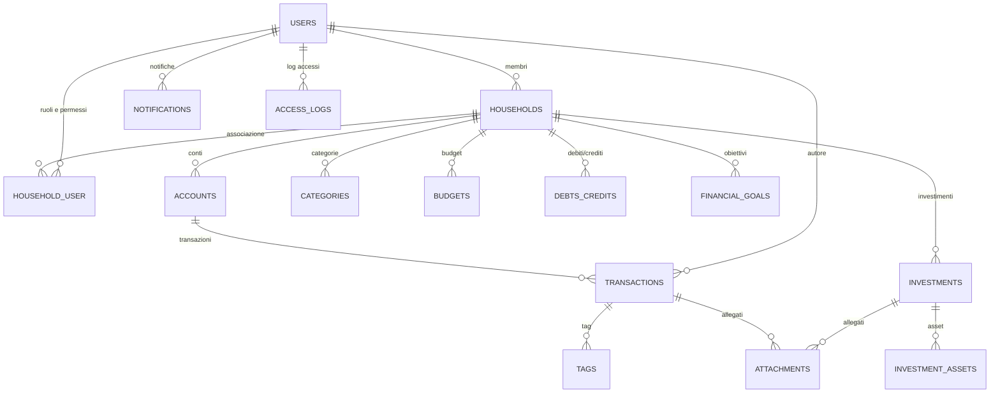
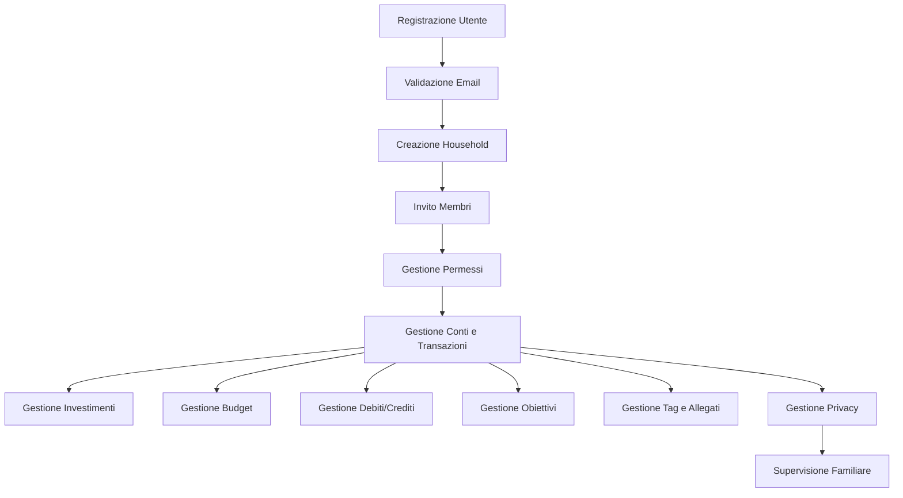

# Diagramma delle Entità Principali

---

# Diagramma Flusso Utente (Registrazione e Gestione Household)

---

> I diagrammi sono generati con sintassi Mermaid e possono essere visualizzati direttamente su GitHub o tramite plugin VS Code.
