# Finanzamente

Webapp di **finanza personale** in italiano (EUR), pensata per uso individuale o in nucleo (household).  
**Open source**, licenza [MIT](LICENSE) — Copyright (c) 2026 Matteo Nossa.  
Nessun SaaS ufficiale: installazione **self-host** (Docker + `make`).

Repository: <https://github.com/mnossa/finanzamente>

## Anteprima

Screenshot da installazione locale con `make demo-data` (utente demo Mario Rossi).

### Dashboard

<p>
  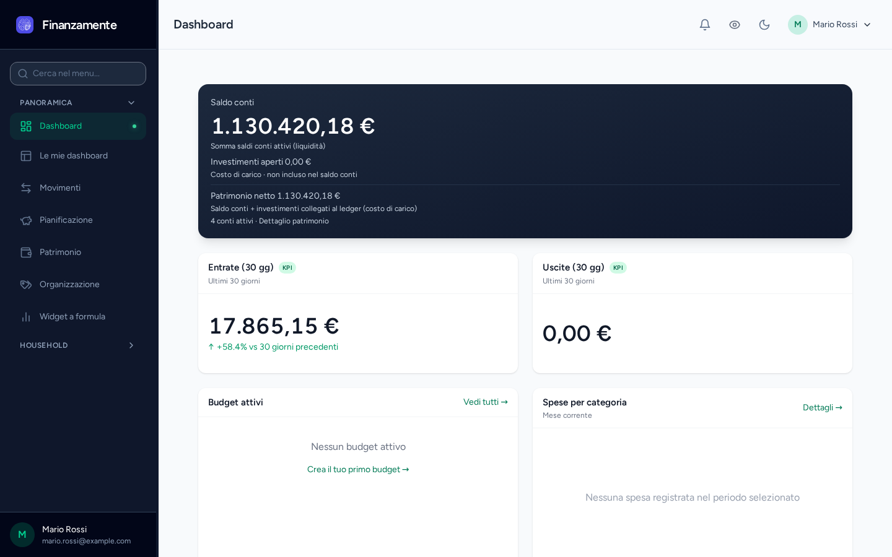
</p>
<p>
  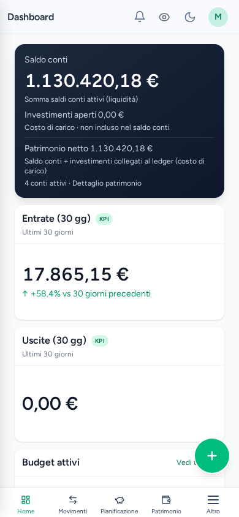
</p>

### Movimenti e conti

<p>
  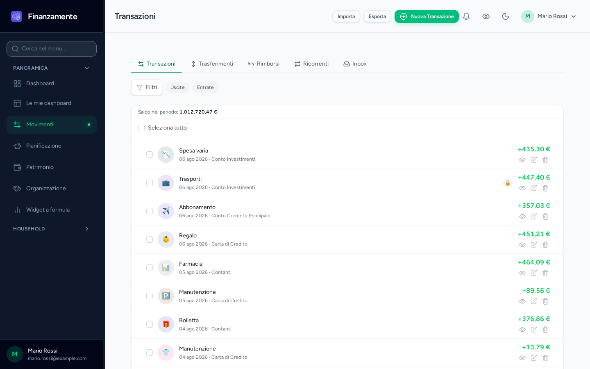
</p>
<p>
  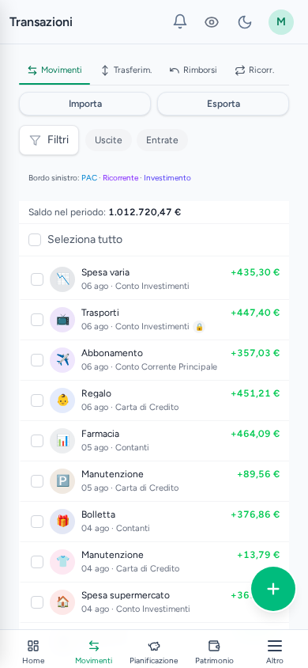
</p>
<p>
  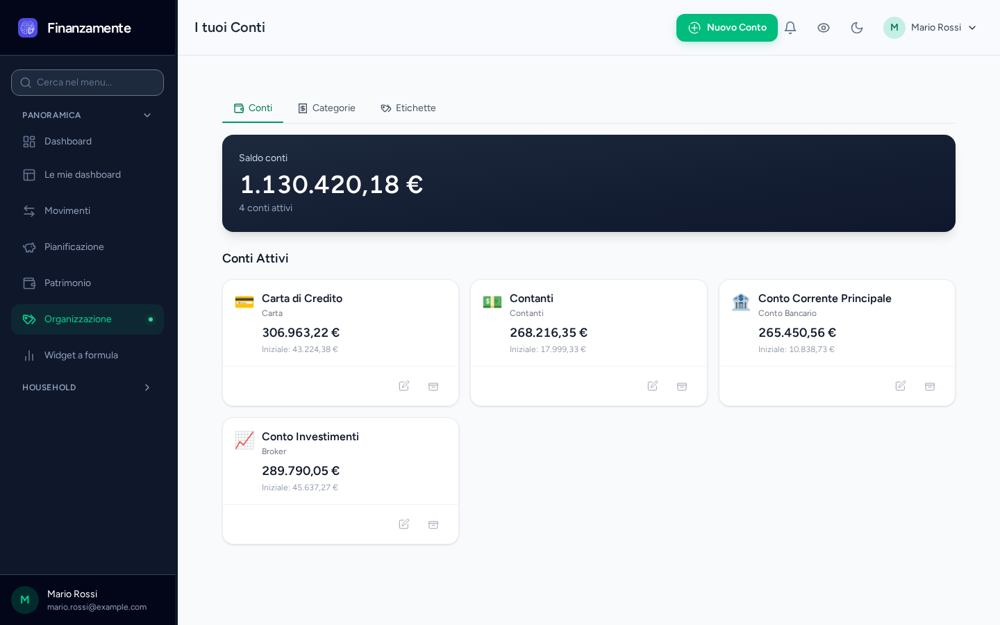
</p>

### Pianificazione

<p>
  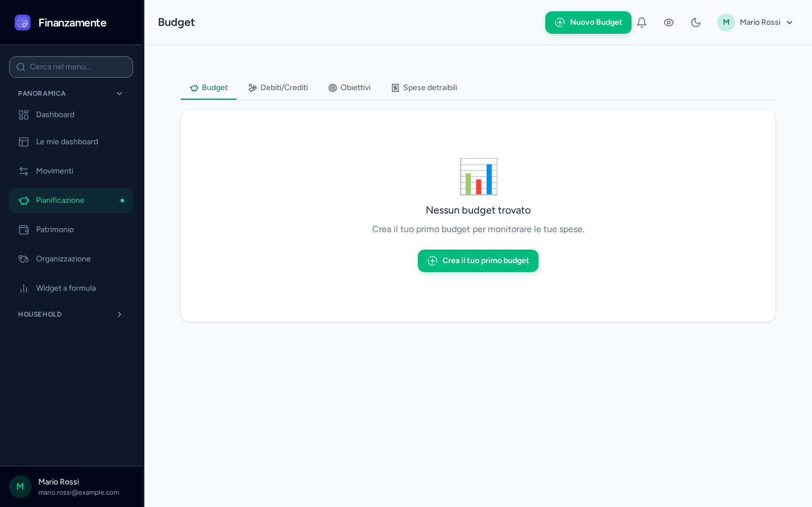
</p>
<p>
  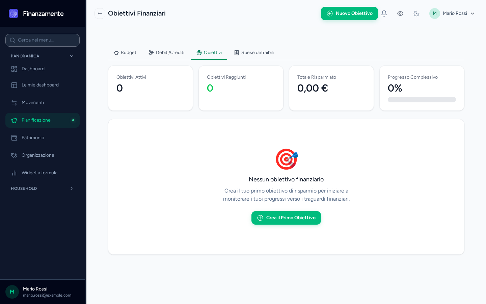
</p>
<p>
  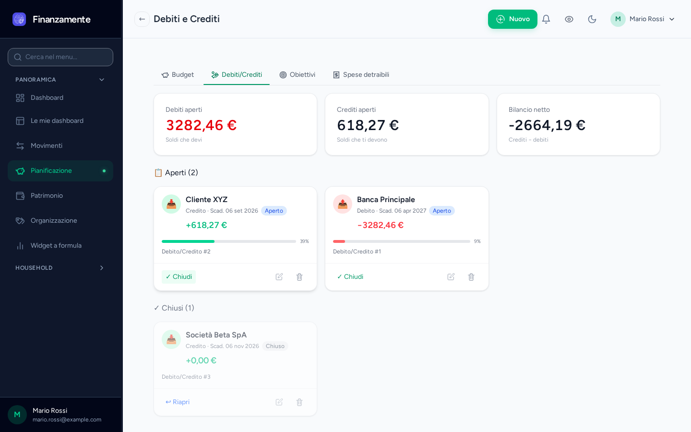
</p>

### Patrimonio e investimenti

<p>
  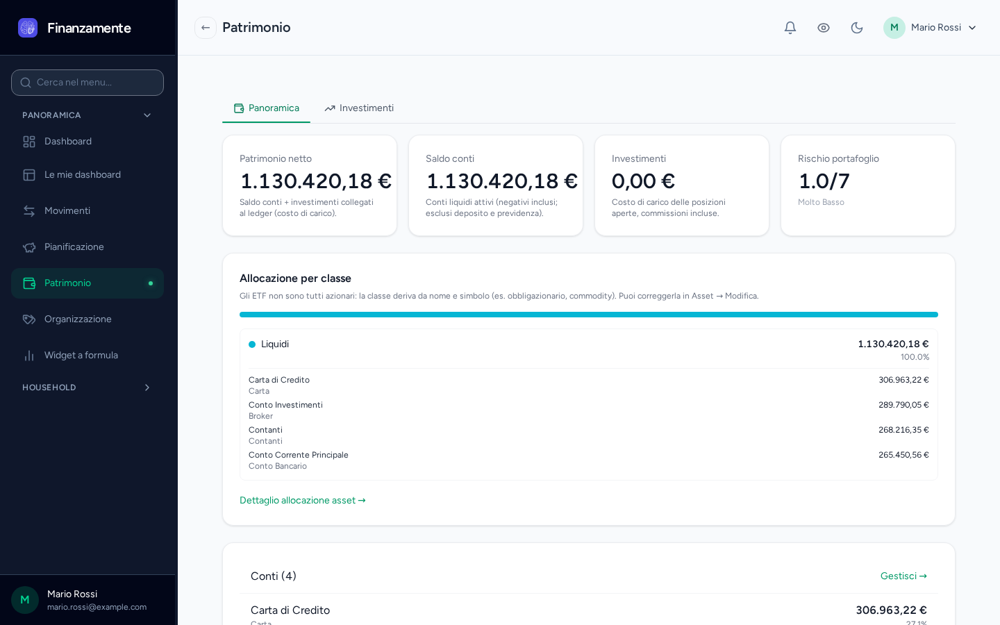
</p>
<p>
  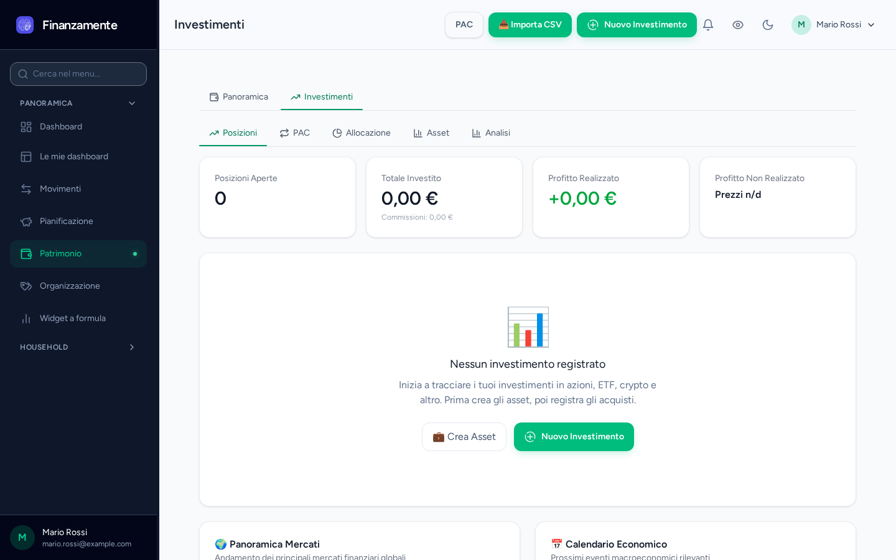
</p>

### Organizzazione

<p>
  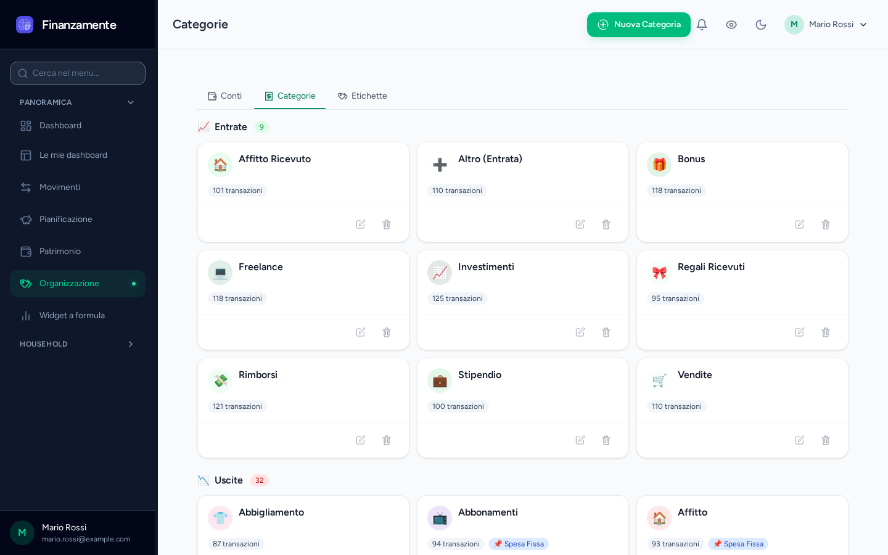
</p>
<p>
  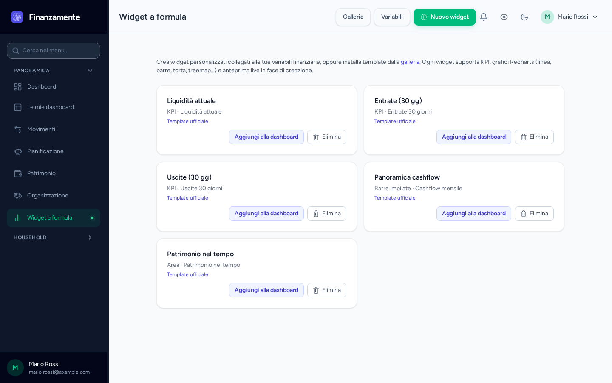
</p>

Rigenera (stack up + `make demo-data`):

```bash
node scripts/capture-readme-screenshots.mjs
```

## Stack

| Layer | Tecnologia |
|-------|------------|
| Backend | Laravel (session auth, policies, services) |
| Dashboard | Inertia.js + React + TypeScript |
| Pubblico | Blade + Tailwind |
| DB / cache | MySQL + Redis |
| Infra locale | Docker Compose |

## Requisiti

- Docker + Docker Compose
- Make
- Porte libere: **8080** (app), **5174** (Vite con `make dev`), **8081** (E2E)

## Quickstart (fork / clone fresco)

```bash
git clone https://github.com/mnossa/finanzamente.git
cd finanzamente

cp .env.example .env
# Obbligatorio: sostituisci ADV_THROTTLE_SALT con una stringa lunga e casuale
# (vedi commenti in .env.example). Gli altri default Docker vanno bene in locale.

make up          # primo avvio: build immagini + attesa MySQL/Redis (può richiedere alcuni minuti)
make setup       # composer, APP_KEY, storage:link, migrate, npm, build frontend
```

Apri <http://localhost:8080>.

Dati demo (opzionale):

```bash
make demo-data
# mario.rossi@example.com / laura.bianchi@example.com — password: password
```

Mail locale: Mailpit (porta in `docker-compose.yml`, tipicamente UI su `8025`).

### Comandi equivalenti (senza `make setup`)

```bash
make up
make composer-install
docker compose exec app php artisan key:generate
docker compose exec app php artisan storage:link --force
make migrate
make npm-install
make build
```

### Reset completo dello stack

```bash
docker compose down -v --remove-orphans   # cancella anche i volumi MySQL
# opzionale: docker rmi finanzamente-app
cp .env.example .env   # poi ADV_THROTTLE_SALT + make up && make setup
```

Il tuo `.env` locale **non** è nel git: tienine un backup prima di sovrascriverlo.

## Documentazione

- [Documentazione tecnica](docs/technical.md) — architettura, env, integrazioni, contributi
- [Guida contributor](docs/contributor-guide.md)
- [Convenzioni agent / Make](docs/agent/)

## Test

```bash
make test          # PHPUnit (SQLite in-memory)
make pint-check    # stile PHP
make playwright    # E2E su porta 8081 (serve make up + make e2e-seed)
```

## Integrazioni opzionali

Configurabili via `.env` (dettaglio in `.env.example` e `docs/technical.md`):

- **Telegram** — inserimento spese via bot
- **Google Drive / Sheets** — import file e export household  
  (`make export-google-sheets spreadsheet=SPREADSHEET_ID`)

## Pagine legali

`/privacy`, `/cookie`, `/termini` sono **placeholder**: chi pubblica un’istanza deve sostituirle con testi propri e aggiornare `config/legal.php` (`privacy_policy_version`).

## Licenza

MIT — vedi [LICENSE](LICENSE).
